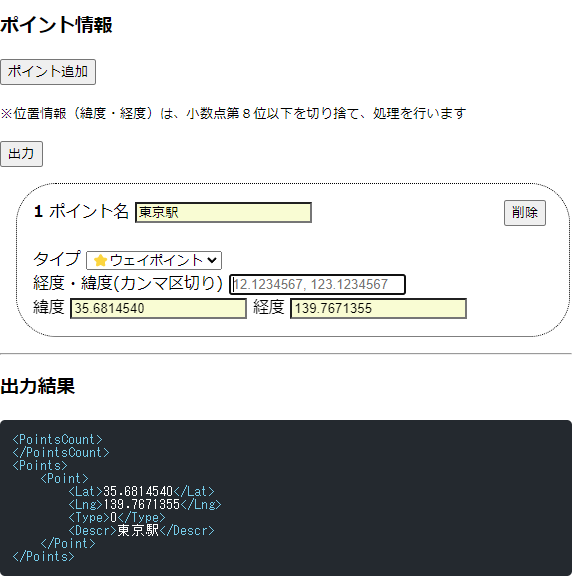

# POI-RAW-CODE-EDITOR



## Overview

Generating POI part for CNX format GPS files.

## Requirement

text editor.

## Usage

```bash
$ git clone git@github.com:nakimoen/POI-RAW-CODE-EDITOR.git
$ cd POI-RAW-CODE-EDITOR
#=> THEN, BROWSE "index.html".
```

OR

visit [THE SITE](http://nakimoen.github.io/POI-RAW-CODE-EDITOR)

<!-- ## Features -->

## Author

[twitter](https://twitter.com/hsnakimoen)

## Licence

Under [MIT](http://nakimoen.github.io/POI-RAW-CODE-EDITOR/LICENSE)

Used/Included packages

- [vkbeautify](http://www.eslinstructor.net/vkbeautify/)
